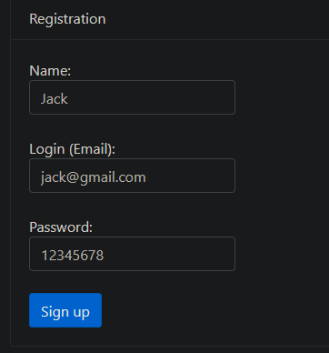
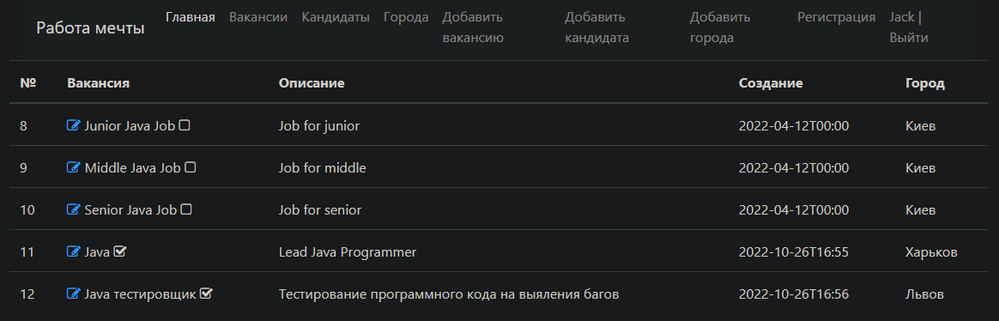
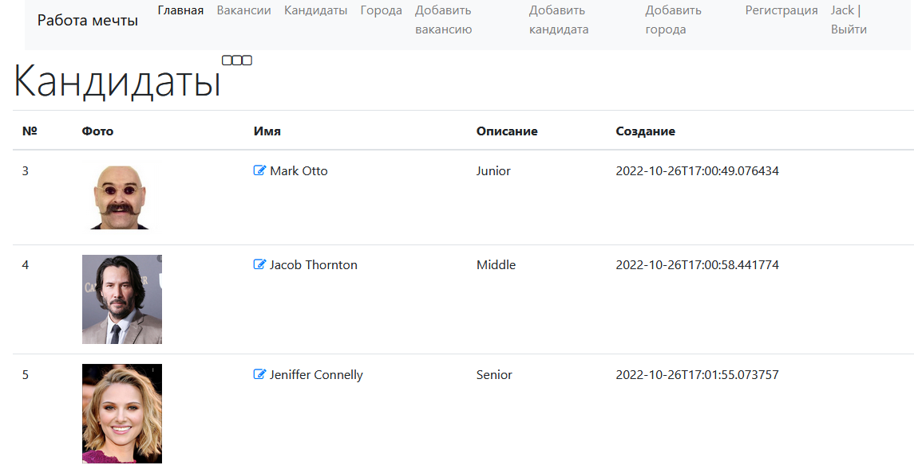
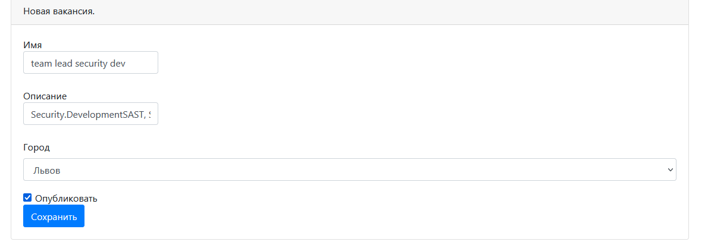
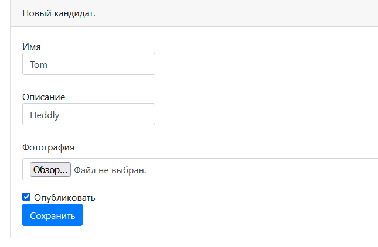

# Проект "Работа мечты"
## Веб-приложение на Spring Boot

## О проекте:
- Приложение работает через интернет-браузер
- Система имеет две модели: вакансии и резюме
- Кандидаты могут публиковать резюме
- HR опубликует вакансии.
- Кандидаты могут подать заявку на работу. 
- Отдел кадров может пригласить кандидата на вакансию.
- Авторизация и аутентификация пользователя.

### Сборка и монтаж:
Создать базу данных "работа мечты"
Измените имя пользователя и пароль вашей базы данных PostgreSQL в 'src/main/resources/app.properties' 
и 'db/liquibase.properties', используя Spring Boot CLI

```shell
mvn spring-boot:run -Dspring-boot.run.arguments=--db=your_database,--user=your_user,--password=your_password,--port=your_port
```
ИЛИ используя свойства по умолчанию(db=dreamjob, user=postgres, password=пароль, порт=8080)

```shell
mvn spring-boot:run
```
3. Go to http://localhost:8080/index

### TODO list
Программа может:
1. Создавайте, читайте, обновляйте вакансиях
2. Создавайте, читайте, обновляйте резюме
3. Создавайте, читайте, обновляйте города
4. Добавлять фотографию кандидату
5. Регистрировать на веб-сайте
6. Авторизоваться на веб-сайте

### Used technologies:


### Screenshots




